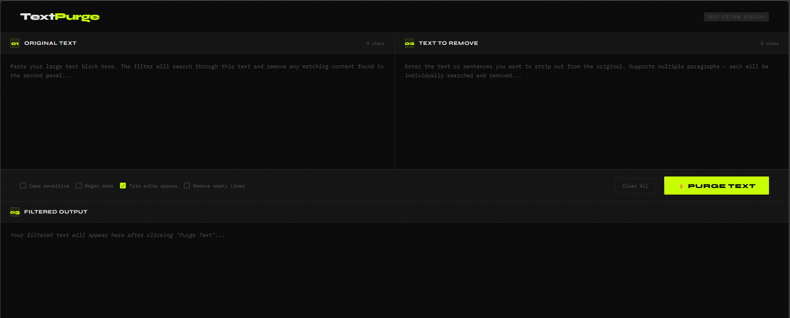

# TextPurge — Text Filter Utility

A clean, browser-based tool that lets you strip specific text, sentences, or paragraphs from a large body of text — instantly, with no backend required.

---

## Screenshot

<!-- Add your screenshot here -->


---

## Features

- **Large text support** — handles thousands of words without slowdown
- **Multi-segment removal** — separate removal targets by double newlines to strip multiple paragraphs independently
- **Case sensitive toggle** — choose whether matching should respect letter casing
- **Regex mode** — power users can use regular expressions for advanced pattern matching
- **Trim extra spaces** — automatically cleans up leftover whitespace after removal
- **Remove empty lines** — collapses blank lines left behind from stripped content
- **Live character counters** — tracks input length in real time on both panels
- **Stats bar** — shows original length, removed length, result length, and % reduction
- **One-click copy** — copies the filtered output to clipboard instantly
- **Keyboard shortcut** — press `Ctrl + Enter` (or `Cmd + Enter` on Mac) to run the filter

---

## How to Use

1. **Paste your original text** into the left panel (Panel 01)
2. **Paste the text you want removed** into the right panel (Panel 02)
3. *(Optional)* Adjust the filter options in the controls bar
4. Click **⚡ Purge Text** or press `Ctrl + Enter`
5. The filtered result appears in **Panel 03** below
6. Click **Copy Output** to copy the result to your clipboard

---

## Filter Options

| Option | Description |
|---|---|
| Case sensitive | Matches exact casing when enabled |
| Regex mode | Treats removal text as a regular expression pattern |
| Trim extra spaces | Collapses multiple spaces left after removal |
| Remove empty lines | Strips blank lines from the output |

---

## Getting Started

Since TextPurge is a pure HTML/CSS/JS file with no dependencies or build steps, setup is instant.

```bash
# Clone or download the file
git clone https://github.com/your-username/textpurge.git

# Open directly in your browser
open text-filter.html
```

No installation. No server. No internet connection required after loading.

---

## File Structure

```
textpurge/
├── text-filter.html   # The entire application (single file)
└── README.md
```

---

## Browser Support

Works in all modern browsers — Chrome, Firefox, Safari, and Edge.

---

## License

MIT — free to use, modify, and distribute.
